# GeoGPT-RAG Project Diagrams

This document contains all architectural diagrams, workflows, and visual representations of the GeoGPT-RAG system.

## Table of Contents
1. [System Architecture](#system-architecture)
2. [Technical Infrastructure](#technical-infrastructure)
3. [Core Workflows](#core-workflows)
4. [GIS Tools Integration](#gis-tools-integration)
5. [Data Flow Diagrams](#data-flow-diagrams)
6. [Use Case Diagrams](#use-case-diagrams)
7. [Deployment Architecture](#deployment-architecture)

---

## 1. System Architecture

### High-Level System Overview
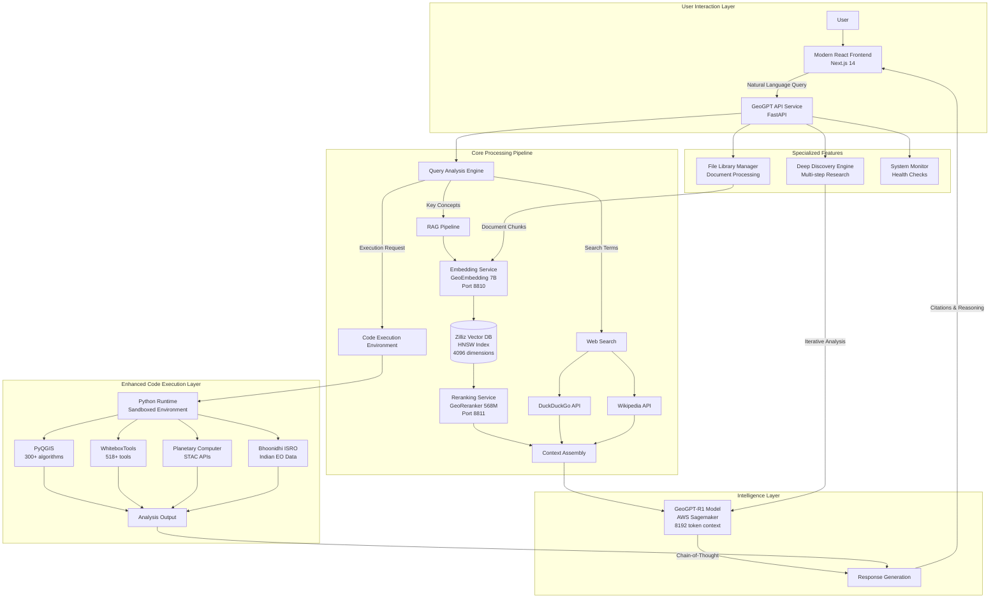
```mermaid
graph TB
    subgraph "User Interaction Layer"
        U[User] --> UI[Modern React Frontend<br/>Next.js 14]
        UI --> |Natural Language Query| API[GeoGPT API Service<br/>FastAPI]
    end
    
    subgraph "Core Processing Pipeline"
        API --> QA[Query Analysis Engine]
        QA --> |Key Concepts| RAG[RAG Pipeline]
        QA --> |Search Terms| WS[Web Search]
        QA --> |Execution Request| EXE[Code Execution Environment]
        
        RAG --> EMB[Embedding Service<br/>GeoEmbedding 7B<br/>Port 8810]
        EMB --> VDB[(Zilliz Vector DB<br/>HNSW Index<br/>4096 dimensions)]
        VDB --> RNK[Reranking Service<br/>GeoReranker 568M<br/>Port 8811]
        
        WS --> DDG[DuckDuckGo API]
        WS --> WIKI[Wikipedia API]
        
        RNK --> CTX[Context Assembly]
        DDG --> CTX
        WIKI --> CTX
    end
    
    subgraph "Intelligence Layer"
        CTX --> LLM[GeoGPT-R1 Model<br/>AWS Sagemaker<br/>8192 token context]
        LLM --> |Chain-of-Thought| RSP[Response Generation]
        RSP --> |Citations & Reasoning| UI
    end
    
    subgraph "Enhanced Code Execution Layer"
        EXE --> PY[Python Runtime<br/>Sandboxed Environment]
        PY --> QGIS[PyQGIS<br/>300+ algorithms]
        PY --> WBT[WhiteboxTools<br/>518+ tools]
        PY --> PC[Planetary Computer<br/>STAC APIs]
        PY --> BHOO[Bhoonidhi ISRO<br/>Indian EO Data]
        
        QGIS --> OUT[Analysis Output]
        WBT --> OUT
        PC --> OUT
        BHOO --> OUT
        OUT --> RSP
    end
    
    subgraph "Specialized Features"
        API --> DD[Deep Discovery Engine<br/>Multi-step Research]
        DD --> |Iterative Analysis| LLM
        
        API --> FL[File Library Manager<br/>Document Processing]
        FL --> |Document Chunks| EMB
        
        API --> SM[System Monitor<br/>Health Checks]
    end
```

### Frontend Component Architecture
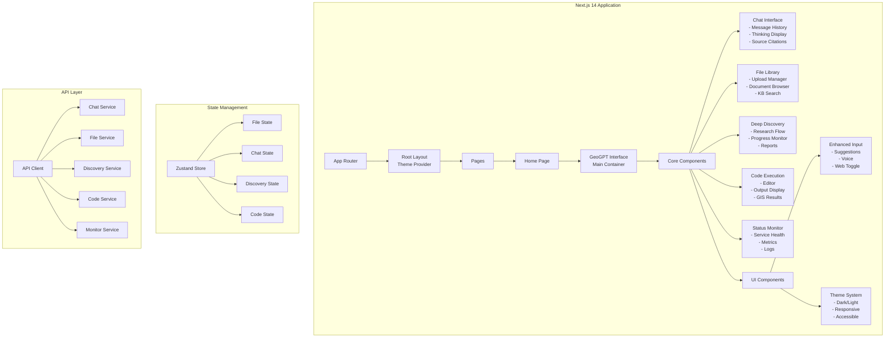
```mermaid
graph TB
    subgraph "Next.js 14 Application"
        APP[App Router] --> LAYOUT[Root Layout<br/>Theme Provider]
        LAYOUT --> PAGES[Pages]
        
        PAGES --> HOME[Home Page]
        HOME --> GI[GeoGPT Interface<br/>Main Container]
        
        GI --> COMP[Core Components]
        COMP --> CHAT[Chat Interface<br/>- Message History<br/>- Thinking Display<br/>- Source Citations]
        COMP --> FILE[File Library<br/>- Upload Manager<br/>- Document Browser<br/>- KB Search]
        COMP --> DISC[Deep Discovery<br/>- Research Flow<br/>- Progress Monitor<br/>- Reports]
        COMP --> CODE[Code Execution<br/>- Editor<br/>- Output Display<br/>- GIS Results]
        COMP --> STAT[Status Monitor<br/>- Service Health<br/>- Metrics<br/>- Logs]
        
        COMP --> UI[UI Components]
        UI --> INPUT[Enhanced Input<br/>- Suggestions<br/>- Voice<br/>- Web Toggle]
        UI --> THEME[Theme System<br/>- Dark/Light<br/>- Responsive<br/>- Accessible]
    end
    
    subgraph "State Management"
        STORE[Zustand Store] --> FSTATE[File State]
        STORE --> CSTATE[Chat State]
        STORE --> DSTATE[Discovery State]
        STORE --> SCODE[Code State]
    end
    
    subgraph "API Layer"
        API[API Client] --> CHAT_API[Chat Service]
        API --> FILE_API[File Service]
        API --> DISC_API[Discovery Service]
        API --> CODE_API[Code Service]
        API --> MON_API[Monitor Service]
    end
```

## 2. Technical Infrastructure

### AWS Deployment Architecture
```mermaid
graph TB
    subgraph "AWS Cloud Infrastructure"
        subgraph "EC2 Instance (g5.xlarge)"
            EC2[Ubuntu 22.04<br/>NVIDIA GPU Drivers]
            EC2 --> DOCKER[Docker Engine<br/>GPU Support]
            
            DOCKER --> C1[Container: Embedding Service<br/>Port 8810<br/>GeoEmbedding 7B]
            DOCKER --> C2[Container: Reranking Service<br/>Port 8811<br/>GeoReranker 568M]
            DOCKER --> C3[Container: Main API<br/>Port 8812<br/>FastAPI + Services]
            
            C3 --> VOL[Volumes]
            VOL --> MODELS[/app/models<br/>Model Weights]
            VOL --> LOGS[/app/logs<br/>Service Logs]
            VOL --> DATA[/app/data<br/>User Data]
        end
        
        subgraph "External AWS Services"
            SAGE[AWS Sagemaker<br/>GeoGPT-R1 Endpoint<br/>us-east-1]
            S3[S3 Bucket<br/>Model Storage<br/>Backups]
        end
        
        subgraph "Network Configuration"
            SG[Security Group]
            SG --> |8810| P1[Embedding API]
            SG --> |8811| P2[Reranking API]
            SG --> |8812| P3[Main API]
            SG --> |22| SSH[SSH Access]
            
            EIP[Elastic IP<br/>3.234.222.18]
        end
    end
    
    subgraph "External Services"
        ZIL[Zilliz Cloud<br/>Vector Database<br/>us-west-1]
        WEB[Web APIs<br/>DuckDuckGo<br/>Wikipedia]
        PC[Planetary Computer<br/>STAC Catalog]
        ISRO[Bhoonidhi<br/>ISRO APIs]
    end
    
    C1 --> ZIL
    C3 --> SAGE
    C3 --> WEB
    C3 --> PC
    C3 --> ISRO
```

## 3. Core Workflows

### RAG (Retrieval-Augmented Generation) Pipeline
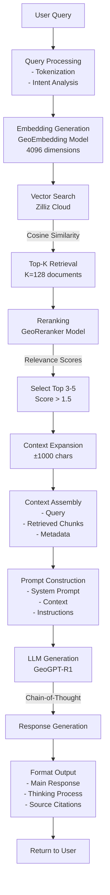
```mermaid
graph TB
    START[User Query] --> PROC[Query Processing<br/>- Tokenization<br/>- Intent Analysis]
    
    PROC --> EMB_GEN[Embedding Generation<br/>GeoEmbedding Model<br/>4096 dimensions]
    
    EMB_GEN --> VEC_SEARCH[Vector Search<br/>Zilliz Cloud]
    VEC_SEARCH --> |Cosine Similarity| RECALL[Top-K Retrieval<br/>K=128 documents]
    
    RECALL --> RERANK[Reranking<br/>GeoReranker Model]
    RERANK --> |Relevance Scores| SELECT[Select Top 3-5<br/>Score > 1.5]
    
    SELECT --> EXPAND[Context Expansion<br/>±1000 chars]
    
    EXPAND --> ASSEMBLE[Context Assembly<br/>- Query<br/>- Retrieved Chunks<br/>- Metadata]
    
    ASSEMBLE --> PROMPT[Prompt Construction<br/>- System Prompt<br/>- Context<br/>- Instructions]
    
    PROMPT --> LLM[LLM Generation<br/>GeoGPT-R1]
    LLM --> |Chain-of-Thought| RESPONSE[Response Generation]
    
    RESPONSE --> FORMAT[Format Output<br/>- Main Response<br/>- Thinking Process<br/>- Source Citations]
    
    FORMAT --> USER[Return to User]
```

### Deep Discovery Research Workflow
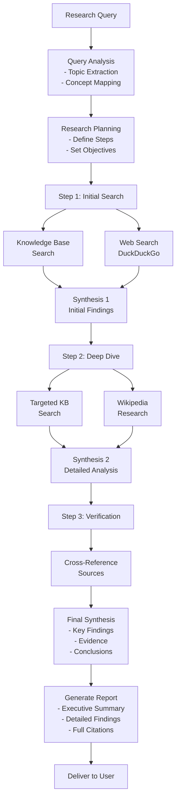
```mermaid
graph TB
    QUERY[Research Query] --> ANALYZE[Query Analysis<br/>- Topic Extraction<br/>- Concept Mapping]
    
    ANALYZE --> PLAN[Research Planning<br/>- Define Steps<br/>- Set Objectives]
    
    PLAN --> STEP1[Step 1: Initial Search]
    STEP1 --> KB1[Knowledge Base<br/>Search]
    STEP1 --> WEB1[Web Search<br/>DuckDuckGo]
    
    KB1 --> SYNTH1[Synthesis 1<br/>Initial Findings]
    WEB1 --> SYNTH1
    
    SYNTH1 --> STEP2[Step 2: Deep Dive]
    STEP2 --> KB2[Targeted KB<br/>Search]
    STEP2 --> WIKI[Wikipedia<br/>Research]
    
    KB2 --> SYNTH2[Synthesis 2<br/>Detailed Analysis]
    WIKI --> SYNTH2
    
    SYNTH2 --> STEP3[Step 3: Verification]
    STEP3 --> CROSS[Cross-Reference<br/>Sources]
    
    CROSS --> FINAL[Final Synthesis<br/>- Key Findings<br/>- Evidence<br/>- Conclusions]
    
    FINAL --> REPORT[Generate Report<br/>- Executive Summary<br/>- Detailed Findings<br/>- Full Citations]
    
    REPORT --> DELIVER[Deliver to User]
```

### Code Execution Security Workflow
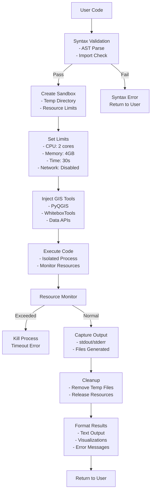
```mermaid
graph TB
    CODE[User Code] --> VALIDATE[Syntax Validation<br/>- AST Parse<br/>- Import Check]
    
    VALIDATE --> |Pass| SANDBOX[Create Sandbox<br/>- Temp Directory<br/>- Resource Limits]
    VALIDATE --> |Fail| ERROR1[Syntax Error<br/>Return to User]
    
    SANDBOX --> LIMITS[Set Limits<br/>- CPU: 2 cores<br/>- Memory: 4GB<br/>- Time: 30s<br/>- Network: Disabled]
    
    LIMITS --> INJECT[Inject GIS Tools<br/>- PyQGIS<br/>- WhiteboxTools<br/>- Data APIs]
    
    INJECT --> EXECUTE[Execute Code<br/>- Isolated Process<br/>- Monitor Resources]
    
    EXECUTE --> MONITOR[Resource Monitor]
    MONITOR --> |Exceeded| KILL[Kill Process<br/>Timeout Error]
    MONITOR --> |Normal| CAPTURE[Capture Output<br/>- stdout/stderr<br/>- Files Generated]
    
    CAPTURE --> CLEAN[Cleanup<br/>- Remove Temp Files<br/>- Release Resources]
    
    CLEAN --> FORMAT[Format Results<br/>- Text Output<br/>- Visualizations<br/>- Error Messages]
    
    FORMAT --> RETURN[Return to User]
```

## 4. GIS Tools Integration

### Integrated GIS Workflow Architecture
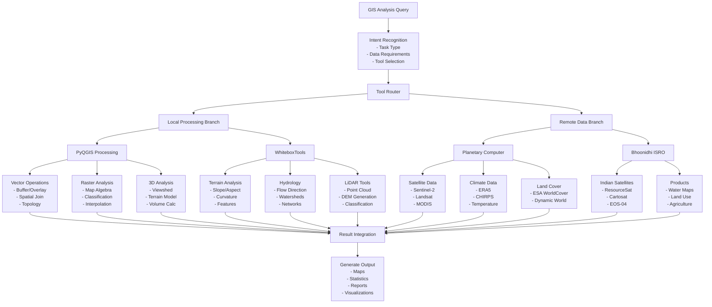
```mermaid
graph TB
    QUERY[GIS Analysis Query] --> INTENT[Intent Recognition<br/>- Task Type<br/>- Data Requirements<br/>- Tool Selection]
    
    INTENT --> ROUTER[Tool Router]
    
    ROUTER --> LOCAL[Local Processing Branch]
    ROUTER --> REMOTE[Remote Data Branch]
    
    LOCAL --> QGIS[PyQGIS Processing]
    LOCAL --> WBT[WhiteboxTools]
    
    QGIS --> QVEC[Vector Operations<br/>- Buffer/Overlay<br/>- Spatial Join<br/>- Topology]
    QGIS --> QRAS[Raster Analysis<br/>- Map Algebra<br/>- Classification<br/>- Interpolation]
    QGIS --> Q3D[3D Analysis<br/>- Viewshed<br/>- Terrain Model<br/>- Volume Calc]
    
    WBT --> WTER[Terrain Analysis<br/>- Slope/Aspect<br/>- Curvature<br/>- Features]
    WBT --> WHYD[Hydrology<br/>- Flow Direction<br/>- Watersheds<br/>- Networks]
    WBT --> WLID[LiDAR Tools<br/>- Point Cloud<br/>- DEM Generation<br/>- Classification]
    
    REMOTE --> PC[Planetary Computer]
    REMOTE --> ISRO[Bhoonidhi ISRO]
    
    PC --> PCSAT[Satellite Data<br/>- Sentinel-2<br/>- Landsat<br/>- MODIS]
    PC --> PCCLIM[Climate Data<br/>- ERA5<br/>- CHIRPS<br/>- Temperature]
    PC --> PCLC[Land Cover<br/>- ESA WorldCover<br/>- Dynamic World]
    
    ISRO --> ISROSAT[Indian Satellites<br/>- ResourceSat<br/>- Cartosat<br/>- EOS-04]
    ISRO --> ISROPROD[Products<br/>- Water Maps<br/>- Land Use<br/>- Agriculture]
    
    QVEC --> INTEGRATE[Result Integration]
    QRAS --> INTEGRATE
    Q3D --> INTEGRATE
    WTER --> INTEGRATE
    WHYD --> INTEGRATE
    WLID --> INTEGRATE
    PCSAT --> INTEGRATE
    PCCLIM --> INTEGRATE
    PCLC --> INTEGRATE
    ISROSAT --> INTEGRATE
    ISROPROD --> INTEGRATE
    
    INTEGRATE --> OUTPUT[Generate Output<br/>- Maps<br/>- Statistics<br/>- Reports<br/>- Visualizations]
```

### Example: Flood Risk Assessment Workflow

```mermaid
graph LR
    START[User: Analyze flood risk<br/>for Chennai] --> S1[Step 1: Get Elevation]
    
    S1 --> PC1[Planetary Computer<br/>Copernicus DEM<br/>30m resolution]
    
    PC1 --> S2[Step 2: Terrain Analysis]
    S2 --> WBT1[WhiteboxTools<br/>- Fill Depressions<br/>- Flow Direction<br/>- Flow Accumulation]
    
    WBT1 --> S3[Step 3: Rainfall Data]
    S3 --> PC2[Planetary Computer<br/>CHIRPS Monthly<br/>Precipitation]
    
    PC2 --> S4[Step 4: Urban Analysis]
    S4 --> QGIS1[PyQGIS<br/>- Extract Urban Areas<br/>- Population Density<br/>- Infrastructure]
    
    QGIS1 --> S5[Step 5: Risk Modeling]
    S5 --> WBT2[WhiteboxTools<br/>- Flood Frequency<br/>- Inundation Mapping]
    
    WBT2 --> S6[Step 6: Risk Zones]
    S6 --> QGIS2[PyQGIS<br/>- Buffer Analysis<br/>- Risk Classification<br/>- Overlay Analysis]
    
    QGIS2 --> S7[Step 7: Visualization]
    S7 --> MAP[Generate Risk Map<br/>- Flood Zones<br/>- Affected Areas<br/>- Statistics]
    
    MAP --> REPORT[Final Report<br/>- Risk Assessment<br/>- Recommendations<br/>- Maps & Charts]
```

## 5. Data Flow Diagrams

### Chat Conversation Data Flow
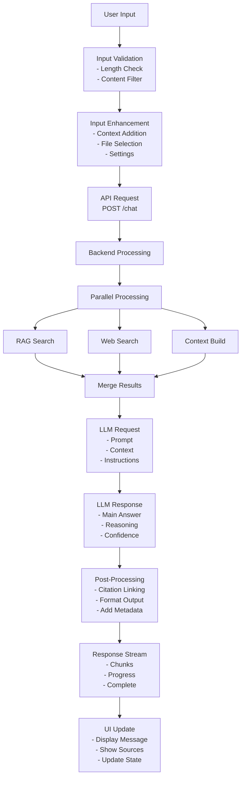
```mermaid
graph TB
    USER[User Input] --> VALID[Input Validation<br/>- Length Check<br/>- Content Filter]
    
    VALID --> ENHANCE[Input Enhancement<br/>- Context Addition<br/>- File Selection<br/>- Settings]
    
    ENHANCE --> API_CALL[API Request<br/>POST /chat]
    
    API_CALL --> BACKEND[Backend Processing]
    
    BACKEND --> PARALLEL[Parallel Processing]
    PARALLEL --> P1[RAG Search]
    PARALLEL --> P2[Web Search]
    PARALLEL --> P3[Context Build]
    
    P1 --> MERGE[Merge Results]
    P2 --> MERGE
    P3 --> MERGE
    
    MERGE --> LLM_REQ[LLM Request<br/>- Prompt<br/>- Context<br/>- Instructions]
    
    LLM_REQ --> LLM_RESP[LLM Response<br/>- Main Answer<br/>- Reasoning<br/>- Confidence]
    
    LLM_RESP --> POST[Post-Processing<br/>- Citation Linking<br/>- Format Output<br/>- Add Metadata]
    
    POST --> STREAM[Response Stream<br/>- Chunks<br/>- Progress<br/>- Complete]
    
    STREAM --> UI[UI Update<br/>- Display Message<br/>- Show Sources<br/>- Update State]
```

### File Processing Pipeline
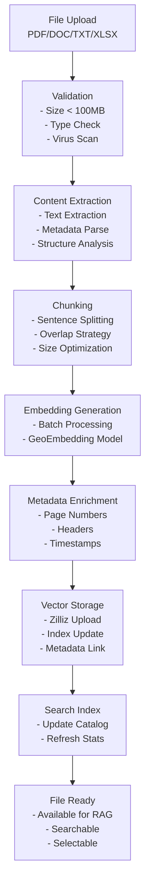
```mermaid
graph TB
    UPLOAD[File Upload<br/>PDF/DOC/TXT/XLSX] --> VALIDATE[Validation<br/>- Size < 100MB<br/>- Type Check<br/>- Virus Scan]
    
    VALIDATE --> EXTRACT[Content Extraction<br/>- Text Extraction<br/>- Metadata Parse<br/>- Structure Analysis]
    
    EXTRACT --> CHUNK[Chunking<br/>- Sentence Splitting<br/>- Overlap Strategy<br/>- Size Optimization]
    
    CHUNK --> EMBED[Embedding Generation<br/>- Batch Processing<br/>- GeoEmbedding Model]
    
    EMBED --> ENRICH[Metadata Enrichment<br/>- Page Numbers<br/>- Headers<br/>- Timestamps]
    
    ENRICH --> STORE[Vector Storage<br/>- Zilliz Upload<br/>- Index Update<br/>- Metadata Link]
    
    STORE --> INDEX[Search Index<br/>- Update Catalog<br/>- Refresh Stats]
    
    INDEX --> READY[File Ready<br/>- Available for RAG<br/>- Searchable<br/>- Selectable]
```

## 6. Use Case Diagrams

### System Use Cases

```mermaid
graph TB
    subgraph "Actors"
        GIS[GIS Professional]
        RES[Researcher]
        STU[Student]
        DEV[Developer]
        ADMIN[Administrator]
    end
    
    subgraph "Core Use Cases"
        UC1[Ask Geospatial Questions]
        UC2[Upload & Manage Documents]
        UC3[Execute GIS Code]
        UC4[Conduct Deep Research]
        UC5[Monitor System Health]
    end
    
    subgraph "Extended Use Cases"
        UC1 --> UC1A[View Chain-of-Thought]
        UC1 --> UC1B[Get Source Citations]
        UC1 --> UC1C[Enable Web Search]
        
        UC2 --> UC2A[Build Knowledge Base]
        UC2 --> UC2B[Search Documents]
        UC2 --> UC2C[Organize Library]
        
        UC3 --> UC3A[Use PyQGIS]
        UC3 --> UC3B[Use WhiteboxTools]
        UC3 --> UC3C[Access Satellite Data]
        UC3 --> UC3D[Generate Visualizations]
        
        UC4 --> UC4A[Multi-step Analysis]
        UC4 --> UC4B[Cross-reference Sources]
        UC4 --> UC4C[Generate Reports]
        
        UC5 --> UC5A[Check Service Status]
        UC5 --> UC5B[View Metrics]
        UC5 --> UC5C[Access Logs]
    end
    
    GIS --> UC1
    GIS --> UC2
    GIS --> UC3
    GIS --> UC4
    
    RES --> UC1
    RES --> UC2
    RES --> UC4
    
    STU --> UC1
    STU --> UC2
    
    DEV --> UC3
    DEV --> UC5
    
    ADMIN --> UC5
```

### GIS Analysis Use Cases
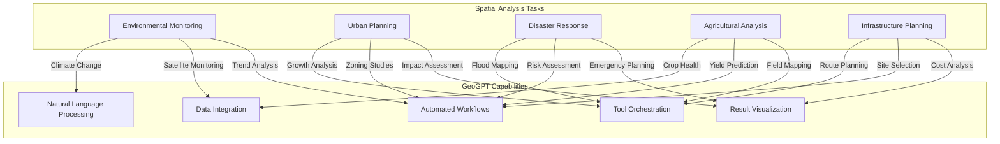
```mermaid
graph TB
    subgraph "Spatial Analysis Tasks"
        T1[Environmental Monitoring]
        T2[Urban Planning]
        T3[Disaster Response]
        T4[Agricultural Analysis]
        T5[Infrastructure Planning]
    end
    
    subgraph "GeoGPT Capabilities"
        C1[Natural Language Processing]
        C2[Tool Orchestration]
        C3[Data Integration]
        C4[Automated Workflows]
        C5[Result Visualization]
    end
    
    T1 --> |Climate Change| C1
    T1 --> |Satellite Monitoring| C3
    T1 --> |Trend Analysis| C4
    
    T2 --> |Growth Analysis| C2
    T2 --> |Zoning Studies| C4
    T2 --> |Impact Assessment| C5
    
    T3 --> |Flood Mapping| C2
    T3 --> |Risk Assessment| C4
    T3 --> |Emergency Planning| C5
    
    T4 --> |Crop Health| C3
    T4 --> |Yield Prediction| C4
    T4 --> |Field Mapping| C2
    
    T5 --> |Route Planning| C2
    T5 --> |Site Selection| C4
    T5 --> |Cost Analysis| C5
```

## 7. Deployment Architecture

### Docker Container Architecture
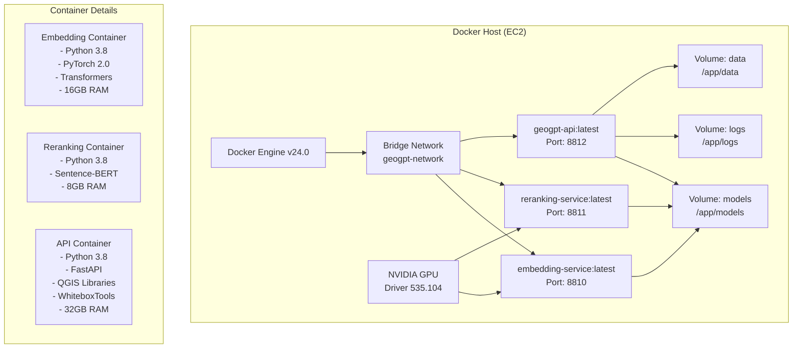
```mermaid
graph TB
    subgraph "Docker Host (EC2)"
        DOCKER[Docker Engine v24.0]
        
        DOCKER --> NET[Bridge Network<br/>geogpt-network]
        
        NET --> C1[embedding-service:latest<br/>Port: 8810]
        NET --> C2[reranking-service:latest<br/>Port: 8811]
        NET --> C3[geogpt-api:latest<br/>Port: 8812]
        
        C1 --> V1[Volume: models<br/>/app/models]
        C2 --> V1
        C3 --> V1
        
        C3 --> V2[Volume: logs<br/>/app/logs]
        C3 --> V3[Volume: data<br/>/app/data]
        
        GPU[NVIDIA GPU<br/>Driver 535.104]
        GPU --> C1
        GPU --> C2
    end
    
    subgraph "Container Details"
        C1_D[Embedding Container<br/>- Python 3.8<br/>- PyTorch 2.0<br/>- Transformers<br/>- 16GB RAM]
        
        C2_D[Reranking Container<br/>- Python 3.8<br/>- Sentence-BERT<br/>- 8GB RAM]
        
        C3_D[API Container<br/>- Python 3.8<br/>- FastAPI<br/>- QGIS Libraries<br/>- WhiteboxTools<br/>- 32GB RAM]
    end
```

### Production Deployment Flow
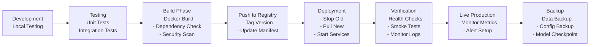
```mermaid
graph LR
    DEV[Development<br/>Local Testing] --> TEST[Testing<br/>Unit Tests<br/>Integration Tests]
    
    TEST --> BUILD[Build Phase<br/>- Docker Build<br/>- Dependency Check<br/>- Security Scan]
    
    BUILD --> PUSH[Push to Registry<br/>- Tag Version<br/>- Update Manifest]
    
    PUSH --> DEPLOY[Deployment<br/>- Stop Old<br/>- Pull New<br/>- Start Services]
    
    DEPLOY --> VERIFY[Verification<br/>- Health Checks<br/>- Smoke Tests<br/>- Monitor Logs]
    
    VERIFY --> LIVE[Live Production<br/>- Monitor Metrics<br/>- Alert Setup]
    
    LIVE --> BACKUP[Backup<br/>- Data Backup<br/>- Config Backup<br/>- Model Checkpoint]
```

## Summary

These diagrams provide a comprehensive visual representation of the GeoGPT-RAG system architecture, workflows, and deployment. They cover:

1. **System Architecture**: Overall system design and component relationships
2. **Technical Infrastructure**: AWS deployment and network configuration
3. **Core Workflows**: RAG pipeline, research flow, and code execution
4. **GIS Integration**: Tool selection and orchestration
5. **Data Flows**: How data moves through the system
6. **Use Cases**: System capabilities and user interactions
7. **Deployment**: Container architecture and deployment process

Each diagram is designed to be accurate, complete, and provide clear understanding of different aspects of the system. They can be rendered using Mermaid in any Markdown viewer that supports it, or exported as images for documentation purposes. 