# GeoGPT-RAG Project Diagrams

This document contains all architectural diagrams, workflows, and visual representations of the GeoGPT-RAG system.

## Table of Contents
1. [System Architecture](#system-architecture)
2. [Technical Infrastructure](#technical-infrastructure)
3. [Core Workflows](#core-workflows)
4. [GIS Tools Integration](#gis-tools-integration)
5. [Data Flow Diagrams](#data-flow-diagrams)
6. [Use Case Diagrams](#use-case-diagrams)
7. [Deployment Architecture](#deployment-architecture)

---

## 1. System Architecture

### High-Level System Overview

### Frontend Component Architecture

## 2. Technical Infrastructure

### AWS Deployment Architecture

## 3. Core Workflows

### RAG (Retrieval-Augmented Generation) Pipeline

```mermaid
graph TB
    START[User Query] --> PROC[Query Processing<br/>- Tokenization<br/>- Intent Analysis]
    
    PROC --> EMB_GEN[Embedding Generation<br/>GeoEmbedding Model<br/>4096 dimensions]
    
    EMB_GEN --> VEC_SEARCH[Vector Search<br/>Zilliz Cloud]
    VEC_SEARCH --> |Cosine Similarity| RECALL[Top-K Retrieval<br/>K=128 documents]
    
    RECALL --> RERANK[Reranking<br/>GeoReranker Model]
    RERANK --> |Relevance Scores| SELECT[Select Top 3-5<br/>Score > 1.5]
    
    SELECT --> EXPAND[Context Expansion<br/>±1000 chars]
    
    EXPAND --> ASSEMBLE[Context Assembly<br/>- Query<br/>- Retrieved Chunks<br/>- Metadata]
    
    ASSEMBLE --> PROMPT[Prompt Construction<br/>- System Prompt<br/>- Context<br/>- Instructions]
    
    PROMPT --> LLM[LLM Generation<br/>GeoGPT-R1]
    LLM --> |Chain-of-Thought| RESPONSE[Response Generation]
    
    RESPONSE --> FORMAT[Format Output<br/>- Main Response<br/>- Thinking Process<br/>- Source Citations]
    
    FORMAT --> USER[Return to User]
```

### Deep Discovery Research Workflow

### Code Execution Security Workflow

## 4. GIS Tools Integration

### Integrated GIS Workflow Architecture

### Example: Flood Risk Assessment Workflow

## 5. Data Flow Diagrams

### Chat Conversation Data Flow

### File Processing Pipeline

## 6. Use Case Diagrams

### System Use Cases

### GIS Analysis Use Cases

## 7. Deployment Architecture

### Docker Container Architecture

### Production Deployment Flow

## 8. Detailed Process Flow Diagram

### Complete GeoGPT-RAG System Process Flow

### Model Lifecycle Flow

## Summary

These diagrams provide a comprehensive visual representation of the GeoGPT-RAG system architecture, workflows, and deployment. They cover:

1. **System Architecture**: Overall system design and component relationships
2. **Technical Infrastructure**: AWS deployment and network configuration
3. **Core Workflows**: RAG pipeline, research flow, and code execution
4. **GIS Integration**: Tool selection and orchestration
5. **Data Flows**: How data moves through the system
6. **Use Cases**: System capabilities and user interactions
7. **Deployment**: Container architecture and deployment process
8. **Process Flow**: Complete end-to-end system operation and model lifecycle

Each diagram is designed to be accurate, complete, and provide clear understanding of different aspects of the system. They can be rendered using Mermaid in any Markdown viewer that supports it, or exported as images for documentation purposes. 