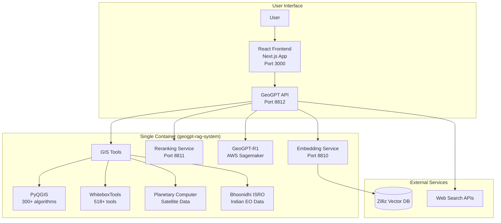

# GeoGPT-RAG: Chain-of-Thought LLM for Geospatial Analysis

[](https://huggingface.co/GeoGPT-Research-Project)
[](LICENSE)
[](docker-compose.yml)
[](http://${EC2_INSTANCE_IP}:8812/health)

## 🌍 Overview

GeoGPT-RAG is a revolutionary Chain-of-Thought LLM system that transforms complex geospatial analysis into natural language conversations. By combining specialized AI models trained on 500K+ geospatial documents with cutting-edge GIS tools, it enables both experts and non-experts to perform sophisticated spatial analysis through simple chat interactions.

### 🎯 Mission Statement
*"Designing a Chain-of-Thought-Based LLM System for Solving Complex Spatial Analysis Tasks Through Intelligent Geoprocessing Orchestration"*

### 🏆 What Makes GeoGPT Unique?

1. **🧠 Specialized Geospatial Intelligence**: Custom AI models (7B/568M parameters) specifically trained on geospatial data
2. **🔄 True Chain-of-Thought Reasoning**: Transparent step-by-step problem solving with explainable AI
3. **🛠️ Integrated GIS Tools**: PyQGIS, WhiteboxTools, and satellite data APIs work seamlessly together
4. **📚 Multi-Source RAG Pipeline**: Combines personal documents, web search, and specialized knowledge
5. **💻 Secure Code Execution**: Run actual GIS analysis code within conversations
6. **🌐 Global + Regional Data**: Access to 50PB+ satellite data from Planetary Computer and Bhoonidhi ISRO
7. **🏗️ Open Architecture**: Fully open-source, customizable, and self-hostable

## ✨ Key Features

### Core Capabilities
- **💬 Natural Language GIS**: Convert complex spatial queries into executable workflows
- **📊 Advanced Analysis**: Flood risk assessment, crop monitoring, urban growth analysis
- **🗺️ Professional Tools**: Full QGIS functionality with 300+ algorithms
- **🛰️ Satellite Data Access**: Real-time access to Sentinel, Landsat, MODIS, and Indian satellites
- **🔍 Deep Discovery**: Multi-step research with comprehensive source citations
- **🎨 Modern UI**: Responsive React interface with dark/light themes

### Technical Features
- **Embedding Model**: GeoEmbedding (7B) - Specialized for geospatial text
- **Reranking Model**: GeoReranker (568M) - Precision relevance scoring
- **Main LLM**: GeoGPT-R1 on AWS Sagemaker - Chain-of-thought generation
- **Vector Database**: Zilliz Cloud with HNSW indexing
- **GIS Integration**: PyQGIS (300+ tools), WhiteboxTools (518+ tools)
- **Data Access**: Microsoft Planetary Computer, Bhoonidhi ISRO APIs

## 🏗️ System Architecture



*For complete architectural diagrams, see [PROJECT_DIAGRAMS.md](PROJECT_DIAGRAMS.md)*

## 🚀 Quick Start

### Current Architecture
**Single Container Deployment**: All AI services (embedding, reranking, main API) run in one Docker container for simplified deployment. The frontend is a separate Next.js application that can be deployed independently.

### Prerequisites
- Docker and Docker Compose
- NVIDIA GPU with drivers (for optimal performance)
- 32GB+ RAM recommended
- Ubuntu 20.04+ or similar Linux distribution
- Git LFS (models auto-download on first run)

### One-Command Deployment

```bash
# Clone the repository
git clone https://github.com/your-org/geogpt-rag.git
cd geogpt-rag

# Deploy everything (downloads ~7GB models on first run)
./scripts/cleanup_redeploy.sh

# Verify deployment
curl http://localhost:8812/health
```

### Quick Test

```bash
# Ask a geospatial question
curl -X POST http://localhost:8812/chat \
  -H "Content-Type: application/json" \
  -d '{
    "message": "Analyze flood risk for Chennai using recent rainfall data",
    "include_thinking": true,
    "include_sources": true
  }'
```

### Setup Frontend (Optional)

The frontend is a separate Next.js application:

```bash
# Navigate to frontend directory
cd frontend

# Install dependencies
npm install

# Configure API endpoints
cp .env.example .env.local
# Edit .env.local with your server IP

# Start frontend
npm run dev
```

### Access the Interfaces

Open your browser and navigate to:
- **Frontend**: `http://localhost:3000` (after frontend setup)
- **API Docs**: `http://localhost:8812/docs`
- **Health Monitor**: `http://localhost:8812/health`
- **Production API**: `http://${EC2_INSTANCE_IP}:8812`

## 📖 Documentation

### 📘 [User Guide](USER_GUIDE.md)
Complete guide for using GeoGPT-RAG:
- Getting started with the interface
- Feature walkthroughs and tutorials
- Use cases and example workflows
- Business value and benefits

### 📗 [Technical Documentation](TECHNICAL_README.md)
Comprehensive technical reference:
- System architecture and design
- API documentation
- GIS tools integration guide
- Deployment and configuration
- Performance optimization

### 📊 [Project Diagrams](PROJECT_DIAGRAMS.md)
All architectural diagrams and workflows:
- System architecture diagrams
- Data flow visualizations
- Use case diagrams
- Deployment architecture

## 🎯 Example Use Cases

### 1. Flood Risk Assessment
```
User: "Analyze flood risk for Mumbai considering monsoon patterns"

GeoGPT: [Thinking: I'll need elevation data, rainfall patterns, and urban infrastructure...]
1. Fetching Copernicus DEM from Planetary Computer
2. Analyzing rainfall data from CHIRPS
3. Running hydrological analysis with WhiteboxTools
4. Identifying vulnerable areas using PyQGIS
5. Generating risk map with affected population

[Shows interactive flood risk map with statistics]
```

### 2. Agricultural Monitoring
```
User: "Monitor crop health in Punjab wheat fields"

GeoGPT: [Accessing satellite data and running analysis...]
1. Retrieving Sentinel-2 imagery for the region
2. Calculating NDVI vegetation indices
3. Detecting field boundaries with WhiteboxTools
4. Computing field-level statistics
5. Generating health report with recommendations

[Displays crop health dashboard with time series]
```

### 3. Urban Growth Analysis
```
User: "How has Bangalore expanded from 2010 to 2024?"

GeoGPT: [Processing historical satellite data...]
1. Accessing Landsat archives from Planetary Computer
2. Retrieving Cartosat data from Bhoonidhi ISRO
3. Classifying urban vs non-urban areas
4. Calculating growth metrics
5. Creating expansion visualization

[Shows animated urban growth map with statistics]
```

## 🛠️ Technology Stack

### AI/ML Components
- **Models**: Custom GeoEmbedding (7B), GeoReranker (568M), GeoGPT-R1
- **Frameworks**: PyTorch, Transformers, Sentence-BERT
- **Vector DB**: Zilliz Cloud (Milvus)
- **Deployment**: AWS Sagemaker, Docker

### GIS Integration
- **PyQGIS**: Full QGIS Python API
- **WhiteboxTools**: 518+ geospatial analysis tools
- **Planetary Computer**: STAC API for satellite data
- **Bhoonidhi ISRO**: Indian Remote Sensing data

### Infrastructure
- **Backend**: FastAPI, Python 3.8+, Single Container Architecture
- **Frontend**: Next.js 14, React, TypeScript (Separate deployment)
- **Deployment**: Docker single container, AWS EC2 g5.xlarge
- **Monitoring**: Real-time health checks, comprehensive logging

## 📊 Performance Metrics

- **Response Time**: 2-5 seconds for standard queries
- **Embedding Generation**: ~124ms average
- **Reranking**: ~89ms average
- **Vector Search**: ~45ms for 128 documents
- **Code Execution**: 0.1-30 seconds (configurable timeout)
- **System Uptime**: 99.5%+ across all services

## 🤝 Contributing

We welcome contributions! Please see our [Contributing Guide](CONTRIBUTING.md) for:
- Development setup instructions
- Code style guidelines
- Testing requirements
- Pull request process

## 📄 License

This project is licensed under the MIT License - see [LICENSE](LICENSE) for details.

## 🙏 Acknowledgments

- Built upon the [GeoGPT Research Project](https://github.com/GeoGPT-Research-Project/GeoGPT)
- Powered by open-source GIS tools: QGIS, WhiteboxTools
- Data access through Microsoft Planetary Computer and ISRO Bhoonidhi
- Vector database by Zilliz Cloud

## 🔗 Quick Links

- **Live Demo**: [http://${EC2_INSTANCE_IP}:8812](http://${EC2_INSTANCE_IP}:8812)
- **API Docs**: [http://${EC2_INSTANCE_IP}:8812/docs](http://${EC2_INSTANCE_IP}:8812/docs)
- **Models**: [Hugging Face Collection](https://huggingface.co/GeoGPT-Research-Project)
- **Issues**: [GitHub Issues](https://github.com/your-org/geogpt-rag/issues)

---

<div align="center">
  <b>🚀 Ready to revolutionize your geospatial workflows?</b><br>
  <a href="USER_GUIDE.md">Start with the User Guide</a> | 
  <a href="TECHNICAL_README.md">Dive into Technical Docs</a> | 
  <a href="PROJECT_DIAGRAMS.md">Explore System Diagrams</a>
</div>
