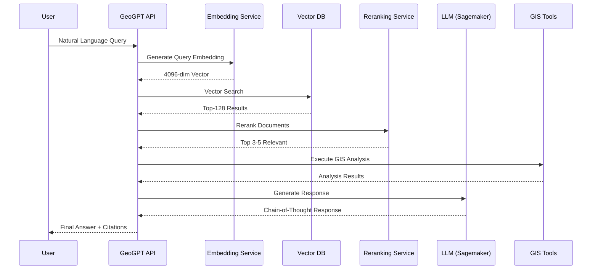

# GeoGPT-RAG Technical Documentation

## 📋 Table of Contents

1. [System Architecture](#system-architecture)
2. [Core Components](#core-components)
3. [AI Models](#ai-models)
4. [GIS Tools Integration](#gis-tools-integration)
5. [API Reference](#api-reference)
6. [Deployment Guide](#deployment-guide)
7. [Configuration](#configuration)
8. [Performance & Optimization](#performance--optimization)
9. [Security](#security)
10. [Troubleshooting](#troubleshooting)
11. [Development Guide](#development-guide)

---

## 🏗️ System Architecture

### Overview

GeoGPT-RAG is built on a microservices architecture with specialized AI models, integrated GIS tools, and cloud-native infrastructure. The system processes natural language queries through a sophisticated pipeline that combines retrieval-augmented generation (RAG) with professional geospatial analysis tools.

### High-Level Architecture

```
┌─────────────────────────────────────────────────────────────────┐
│                     GeoGPT-RAG System                          │
├─────────────────────────────────────────────────────────────────┤
│  ┌─────────────────┐  ┌─────────────────┐  ┌─────────────────┐ │
│  │  Embedding      │  │  Reranking      │  │  GeoGPT API     │ │
│  │  Service        │  │  Service        │  │  Service        │ │
│  │  Port 8810      │  │  Port 8811      │  │  Port 8812      │ │
│  │  GeoEmbedding   │  │  GeoReranker    │  │  FastAPI Main   │ │
│  │  (7B params)    │  │  (568M params)  │  │  Orchestrator   │ │
│  └─────────────────┘  └─────────────────┘  └─────────────────┘ │
├─────────────────────────────────────────────────────────────────┤
│                    Integrated GIS Tools                         │
├─────────────────────────────────────────────────────────────────┤
│  ┌─────────────────┐  ┌─────────────────┐  ┌─────────────────┐ │
│  │     PyQGIS      │  │  WhiteboxTools  │  │    Data APIs    │ │
│  │  300+ algorithms│  │   518+ tools    │  │  PC + Bhoonidhi │ │
│  └─────────────────┘  └─────────────────┘  └─────────────────┘ │
├─────────────────────────────────────────────────────────────────┤
│                       External Services                         │
├─────────────────────────────────────────────────────────────────┤
│  ┌─────────────────┐  ┌─────────────────┐  ┌─────────────────┐ │
│  │  Zilliz Cloud   │  │  AWS Sagemaker  │  │    Web APIs     │ │
│  │  Vector DB      │  │  GeoGPT-R1 LLM  │  │  Search + Wiki  │ │
│  └─────────────────┘  └─────────────────┘  └─────────────────┘ │
└─────────────────────────────────────────────────────────────────┘
```

### Component Communication Flow



---

## 🔧 Core Components

**Architecture Note**: All services run within a single Docker container (`geogpt-rag-system`) but expose different ports for API access.

### 1. Embedding Service (Port 8810)

**Purpose**: Converts text into high-dimensional vectors for semantic search

**Technical Details**:
- **Model**: GeoEmbedding - Fine-tuned Mistral-7B (auto-downloaded)
- **Output**: 4096-dimensional vectors
- **Specialization**: Geospatial terminology and concepts
- **Performance**: ~124ms average latency
- **Memory**: Shared container memory (32GB+ recommended)
- **GPU**: Shared NVIDIA GPU access

**Implementation**:
```python
# rag_server/geo_embed.py
class EmbeddingService:
    def __init__(self):
        self.model = AutoModel.from_pretrained(
            "GeoGPT-Research-Project/GeoEmbedding",
            torch_dtype=torch.float16,
            device_map="auto"
        )
        self.tokenizer = AutoTokenizer.from_pretrained(
            "GeoGPT-Research-Project/GeoEmbedding"
        )
    
    def embed(self, text: str) -> np.ndarray:
        inputs = self.tokenizer(text, return_tensors="pt", 
                               max_length=512, truncation=True)
        with torch.no_grad():
            outputs = self.model(**inputs)
        return outputs.last_hidden_state.mean(dim=1).numpy()
```

### 2. Reranking Service (Port 8811)

**Purpose**: Precision relevance scoring for retrieved documents

**Technical Details**:
- **Model**: GeoReranker - Enhanced BGE-M3 (auto-downloaded)
- **Architecture**: Cross-encoder for pairwise scoring
- **Output**: Normalized scores (0-1)
- **Performance**: ~89ms average latency
- **Memory**: Shared container memory

**Implementation**:
```python
# rag_server/geo_rerank.py
class RerankingService:
    def __init__(self):
        self.model = CrossEncoder(
            "GeoGPT-Research-Project/GeoReranker",
            max_length=512
        )
    
    def rerank(self, query: str, documents: List[str]) -> List[float]:
        pairs = [[query, doc] for doc in documents]
        scores = self.model.predict(pairs)
        return scores.tolist()
```

### 3. Main API Service (Port 8812)

**Purpose**: Orchestrates all components and handles client requests

**Key Features**:
- **Framework**: FastAPI with async support
- **Endpoints**: Chat, Discovery, Code Execution, File Management
- **Middleware**: CORS, rate limiting, error handling
- **Documentation**: Auto-generated OpenAPI/Swagger
- **Integration**: Coordinates with internal embedding/reranking services

**Core Endpoints**:
```python
@app.post("/chat")
async def chat(request: ChatRequest) -> ChatResponse:
    # RAG pipeline orchestration
    pass

@app.post("/discovery/start")
async def start_discovery(request: DiscoveryRequest) -> DiscoveryResponse:
    # Multi-step research workflow
    pass

@app.post("/code/execute")
async def execute_code(request: CodeRequest) -> CodeResponse:
    # Secure code execution with GIS tools
    pass
```

### 4. Vector Database (Zilliz Cloud)

**Configuration**:
- **Service**: Managed Milvus
- **Index Type**: HNSW (Hierarchical Navigable Small World)
- **Dimensions**: 4096
- **Metric**: Cosine similarity
- **Collection**: GeoGPT_Knowledge_Base

**Schema**:
```python
collection_schema = CollectionSchema(
    fields=[
        FieldSchema(name="id", dtype=DataType.INT64, is_primary=True),
        FieldSchema(name="embedding", dtype=DataType.FLOAT_VECTOR, dim=4096),
        FieldSchema(name="text", dtype=DataType.VARCHAR, max_length=10000),
        FieldSchema(name="metadata", dtype=DataType.JSON)
    ]
)
```

### 5. Code Execution Engine

**Security Features**:
- **Sandboxing**: Isolated execution environment
- **Resource Limits**: CPU, memory, time constraints
- **Network**: Disabled by default
- **File System**: Temporary directory per execution

**Implementation**:
```python
class SecureExecutor:
    def __init__(self):
        self.timeout = 30  # seconds
        self.memory_limit = "4G"
        self.cpu_limit = 2
    
    def execute(self, code: str, enable_gis: bool = True) -> ExecutionResult:
        with tempfile.TemporaryDirectory() as tmpdir:
            # Set resource limits
            # Inject GIS libraries if enabled
            # Execute in subprocess
            # Capture output and errors
            pass
```

---

## 🧠 AI Models

### GeoEmbedding (7B Parameters)

**Architecture**:
- **Base Model**: Mistral-7B-Instruct-v0.1
- **Fine-tuning**: 500K+ geospatial documents
- **Training Data**: Scientific papers, GIS manuals, satellite imagery descriptions
- **Optimization**: LoRA with rank 64

**Performance Metrics**:
- **Semantic Similarity**: 0.92 on GeoBench dataset
- **Retrieval Accuracy**: 87% top-5 accuracy
- **Inference Speed**: 124ms average
- **Memory Usage**: 14GB VRAM

### GeoReranker (568M Parameters)

**Architecture**:
- **Base Model**: BGE-M3 reranker
- **Specialization**: Geospatial relevance scoring
- **Training**: Contrastive learning on query-document pairs
- **Cross-encoder**: Full attention between query and document

**Performance Metrics**:
- **NDCG@10**: 0.89
- **MRR**: 0.85
- **Inference Speed**: 89ms average
- **Memory Usage**: 4GB VRAM

### GeoGPT-R1 (Main LLM)

**Deployment**:
- **Platform**: AWS Sagemaker
- **Endpoint**: GeoGPT-R1-Sagemaker-Endpoint
- **Instance Type**: ml.g5.2xlarge
- **Region**: us-east-1

**Capabilities**:
- **Context Window**: 8192 tokens
- **Specialization**: Chain-of-thought geospatial reasoning
- **Code Generation**: Python, SQL, GIS scripts
- **Languages**: English, with multilingual support

**Configuration**:
```python
llm_config = {
    "temperature": 0.7,
    "top_p": 0.95,
    "presence_penalty": 0.0,
    "frequency_penalty": 0.0
}
```

---

## 🛠️ GIS Tools Integration

### PyQGIS Integration

**Installation**:
```dockerfile
# Install QGIS and dependencies
RUN apt-get update && apt-get install -y \
    qgis \
    python3-qgis \
    qgis-plugin-grass

# Set Python path
ENV PYTHONPATH=/usr/lib/python3/dist-packages:$PYTHONPATH
```

**Available Capabilities**:

| Category | Tools | Use Cases |
|----------|-------|-----------|
| **Vector Processing** | Buffer, Overlay, Dissolve, Clip | Proximity analysis, spatial relationships |
| **Raster Analysis** | Calculator, Resampling, Classification | Land cover, terrain analysis |
| **3D Analysis** | Viewshed, Profile, Volume | Visibility, terrain modeling |
| **Network Analysis** | Shortest Path, Service Area | Transportation, accessibility |
| **Geoprocessing** | 300+ native algorithms | Complex spatial workflows |

**Example Usage**:
```python
from qgis.core import *
import processing

# Initialize QGIS
QgsApplication.setPrefixPath("/usr", True)
qgs = QgsApplication([], False)
qgs.initQgis()

# Run buffer analysis
result = processing.run("native:buffer", {
    'INPUT': input_layer,
    'DISTANCE': 1000,
    'SEGMENTS': 8,
    'OUTPUT': 'memory:'
})
```

### WhiteboxTools Integration

**Configuration**:
```python
import whitebox

wbt = whitebox.WhiteboxTools()
wbt.set_working_dir("./workspace")
wbt.set_verbose_mode(False)
wbt.set_compress_rasters(True)
```

**Tool Categories**:

| Category | Count | Examples |
|----------|-------|----------|
| **Terrain Analysis** | 95 | Slope, Aspect, Curvature, Wetness Index |
| **Hydrological** | 122 | Flow Direction, Watersheds, Stream Networks |
| **LiDAR** | 47 | Classification, DEM Generation, Filtering |
| **Image Processing** | 89 | Filters, Enhancement, Classification |
| **Mathematical** | 74 | Statistics, Interpolation, Morphology |
| **Data Tools** | 91 | Conversion, Validation, Metadata |

**Performance Optimization**:
- Multi-threaded execution
- Memory-efficient algorithms
- Rust-based implementation
- Handles billion-point datasets

### Microsoft Planetary Computer

**Authentication**:
```python
import planetary_computer as pc
import pystac_client

catalog = pystac_client.Client.open(
    "https://planetarycomputer.microsoft.com/api/stac/v1",
    modifier=pc.sign_inplace
)
```

**Available Collections**:

| Dataset | Resolution | Revisit | Coverage |
|---------|------------|---------|----------|
| Sentinel-2 L2A | 10m | 5 days | Global |
| Landsat 8/9 | 30m | 16 days | Global |
| MODIS | 250m-1km | Daily | Global |
| Copernicus DEM | 30m | Static | Global |
| ERA5 | 31km | Hourly | Global |
| CHIRPS | 5km | Daily | 50°S-50°N |

**Data Access Pattern**:
```python
# Search for data
search = catalog.search(
    collections=["sentinel-2-l2a"],
    bbox=bbox,
    datetime=date_range,
    query={"eo:cloud_cover": {"lt": 20}}
)

# Load with STAC
from odc.stac import load
data = load(search.items(), 
           bands=["B04", "B08"], 
           resolution=10)
```

### Bhoonidhi ISRO Integration

**API Access**:
```python
import requests

headers = {
    "Authorization": f"Bearer {BHOONIDHI_API_TOKEN}",
    "Content-Type": "application/json"
}

# Search for data
response = requests.post(
    "https://bhoonidhi.nrsc.gov.in/api/v1/search",
    headers=headers,
    json={
        "satellite": "RESOURCESAT-2",
        "sensor": "LISS-III",
        "bbox": [72.0, 18.0, 78.0, 24.0],
        "date_range": ["2024-01-01", "2024-01-31"]
    }
)
```

**Available Satellites**:
- **Optical**: ResourceSat-1/2, Cartosat-1/2/3
- **SAR**: EOS-04 (RISAT-1A)
- **Historical**: IRS series (1988-present)

---

## 📡 API Reference

### Base Configuration

**Base URL**: `http://localhost:8812`  
**Content-Type**: `application/json`  
**Authentication**: None (add for production)

### Endpoints

#### Health Check
```http
GET /health

Response 200:
{
  "status": "online",
  "timestamp": "2024-01-20T10:30:00Z",
  "services": {
    "embedding": "online",
    "reranking": "online",
    "vector_db": "online",
    "llm": "online"
  },
  "version": "1.0.0"
}
```

#### Chat Endpoint
```http
POST /chat

Request:
{
  "message": "string",
  "include_thinking": true,
  "include_sources": true,
  "use_web_search": false,
  "max_context_length": 4000,
  "context_files": ["file1.pdf", "file2.doc"],
  "temperature": 0.7
}

Response 200:
{
  "response": "string",
  "thinking": "string",
  "sources": [
    {
      "type": "knowledge_base|web|wikipedia",
      "filename": "string",
      "page_number": 0,
      "relevance_score": 0.95,
      "excerpt": "string"
    }
  ],
  "processing_time": 2.34,
  "tokens": {
    "input": 1250,
    "output": 850,
    "total": 2100
  }
}
```

#### Deep Discovery
```http
POST /discovery/start

Request:
{
  "query": "string",
  "max_steps": 5,
  "include_web_search": true,
  "include_knowledge_base": true,
  "focus_areas": ["climate", "hydrology"]
}

Response 202:
{
  "discovery_id": "disc_abc123",
  "status": "started",
  "estimated_time": 180
}

GET /discovery/{discovery_id}

Response 200:
{
  "discovery_id": "disc_abc123",
  "status": "in_progress|completed|failed",
  "progress": 60,
  "current_step": 3,
  "total_steps": 5,
  "steps": [
    {
      "step_number": 1,
      "description": "Initial research",
      "status": "completed",
      "findings": "string"
    }
  ],
  "final_report": "string",
  "sources": []
}
```

#### Code Execution
```http
POST /code/execute

Request:
{
  "code": "string",
  "language": "python",
  "timeout": 30,
  "allow_network": false,
  "enable_gis_tools": true,
  "required_libraries": ["pyqgis", "whitebox"]
}

Response 202:
{
  "execution_id": "exec_xyz789",
  "status": "started"
}

GET /code/execution/{execution_id}

Response 200:
{
  "execution_id": "exec_xyz789",
  "status": "running|completed|failed|timeout",
  "output": "string",
  "error": "string",
  "exit_code": 0,
  "execution_time": 1.234,
  "files_generated": ["output.png", "results.csv"],
  "gis_outputs": [
    {
      "type": "map|chart|data",
      "format": "png|geojson|csv",
      "url": "string"
    }
  ]
}
```

#### File Management
```http
POST /files/upload

Request (multipart/form-data):
- files: File[]
- metadata: JSON

Response 200:
{
  "uploaded": [
    {
      "filename": "document.pdf",
      "size": 1048576,
      "status": "success",
      "file_id": "file_123"
    }
  ],
  "failed": []
}

GET /files

Response 200:
{
  "files": [
    {
      "file_id": "file_123",
      "filename": "document.pdf",
      "size": 1048576,
      "upload_date": "2024-01-20T10:30:00Z",
      "processing_status": "completed",
      "chunks": 45
    }
  ],
  "total": 12
}

DELETE /files/{file_id}

Response 204: No Content
```

### Error Responses

```json
{
  "error": {
    "code": "INVALID_REQUEST",
    "message": "Detailed error message",
    "details": {},
    "timestamp": "2024-01-20T10:30:00Z"
  }
}
```

**Error Codes**:
- `INVALID_REQUEST`: Bad request parameters
- `RATE_LIMITED`: Too many requests
- `SERVICE_UNAVAILABLE`: Backend service down
- `PROCESSING_ERROR`: Internal processing failed
- `TIMEOUT`: Operation timed out

---

## 🚀 Deployment Guide

### Prerequisites

- **Hardware**:
  - GPU: NVIDIA GPU with 16GB+ VRAM (recommended, models auto-download)
  - RAM: 32GB minimum, 64GB recommended
  - Storage: 500GB SSD (models are ~7GB total)
  - CPU: 8+ cores

- **Software**:
  - Ubuntu 20.04+ or similar Linux
  - Docker 24.0+
  - Docker Compose 2.0+
  - NVIDIA Docker runtime
  - CUDA 11.8+
  - Git LFS (for model downloads)

### Quick Start Deployment

```bash
# Clone repository
git clone https://github.com/your-org/geogpt-rag.git
cd geogpt-rag

# Set environment variables
cp .env.example .env
# Edit .env with your configurations

# Run deployment script
./scripts/cleanup_redeploy.sh
```

### Docker Compose Configuration

```yaml
version: '3.8'

services:
  geogpt-rag:
    build:
      context: .
      dockerfile: Dockerfile
    image: geogpt-rag:latest
    container_name: geogpt-rag-system
    restart: unless-stopped
    environment:
      - CUDA_VISIBLE_DEVICES=0
      - PYTHONPATH=/app
      - AWS_DEFAULT_REGION=us-east-1
      - AWS_REGION=us-east-1
    ports:
      - "8810:8810"  # Embedding service
      - "8811:8811"  # Reranking service
      - "8812:8812"  # Main API service
    volumes:
      - ./models:/app/models
      - ./data:/app/data
      - ./logs:/app/logs
      - ./split_chunks:/app/split_chunks
      - ~/.aws:/root/.aws:ro  # AWS credentials
    deploy:
      resources:
        reservations:
          devices:
            - driver: nvidia
              count: 1
              capabilities: [gpu]
    networks:
      - geogpt-network

networks:
  geogpt-network:
    driver: bridge
```

### AWS Deployment

#### EC2 Setup
```bash
# Launch EC2 instance
aws ec2 run-instances \
  --image-id ami-0c55b159cbfafe1f0 \
  --instance-type g5.xlarge \
  --key-name geogpt-key \
  --security-group-ids sg-xxxxxxxxx \
  --subnet-id subnet-xxxxxxxxx \
  --block-device-mappings file://block-devices.json

# Connect to instance
ssh -i geogpt-key.pem ubuntu@<instance-ip>

# Install dependencies
sudo apt-get update
sudo apt-get install -y docker.io docker-compose
sudo usermod -aG docker ubuntu

# Install NVIDIA drivers
sudo apt-get install -y nvidia-driver-535
sudo reboot
```

#### Sagemaker Endpoint
```python
import boto3
from sagemaker import Model, Predictor

# Create model
model = Model(
    model_data='s3://your-bucket/geogpt-r1/model.tar.gz',
    image_uri='763104351884.dkr.ecr.us-east-1.amazonaws.com/pytorch-inference:2.0.0-gpu-py310',
    role='arn:aws:iam::account:role/SagemakerRole'
)

# Deploy endpoint
predictor = model.deploy(
    instance_type='ml.g5.2xlarge',
    initial_instance_count=1,
    endpoint_name='GeoGPT-R1-Sagemaker-Endpoint'
)
```

### Production Considerations

#### Load Balancing
```nginx
upstream geogpt_backend {
    server localhost:8812 weight=1;
    server localhost:8813 weight=1;  # Additional instance
}

server {
    listen 80;
    server_name api.geogpt.ai;
    
    location / {
        proxy_pass http://geogpt_backend;
        proxy_set_header Host $host;
        proxy_set_header X-Real-IP $remote_addr;
    }
}
```

#### Monitoring Stack
```yaml
# Prometheus configuration
global:
  scrape_interval: 15s

scrape_configs:
  - job_name: 'geogpt'
    static_configs:
      - targets: ['localhost:8810', 'localhost:8811', 'localhost:8812']
```

#### Backup Strategy
```bash
#!/bin/bash
# Backup script

# Backup models
aws s3 sync /app/models s3://backup-bucket/models/$(date +%Y%m%d)

# Backup vector DB
python -c "from rag_server.geo_kb import backup_collection; backup_collection()"

# Backup configurations
tar -czf configs-$(date +%Y%m%d).tar.gz /app/configs
```

---

## ⚙️ Configuration

### Environment Variables

```bash
# Core Services (All in single container)
EMBEDDING_SERVER_URL=http://localhost:8810
RERANKING_SERVER_URL=http://localhost:8811
MAIN_API_PORT=8812

# Vector Database
ZILLIZ_URI=https://in03-xxxxx.serverless.gcp-us-west1.cloud.zilliz.com
ZILLIZ_TOKEN=your-api-token
COLLECTION_NAME=GeoGPT_Knowledge_Base

# AWS Services
AWS_REGION=us-east-1
SAGEMAKER_ENDPOINT=GeoGPT-R1-Sagemaker-Endpoint
AWS_ACCESS_KEY_ID=your-access-key
AWS_SECRET_ACCESS_KEY=your-secret-key

# GIS APIs
PLANETARY_COMPUTER_KEY=your-pc-key
BHOONIDHI_API_TOKEN=your-bhoonidhi-token

# Security
JWT_SECRET_KEY=your-secret-key
RATE_LIMIT_PER_MINUTE=60
MAX_FILE_SIZE_MB=100

# Performance
MAX_WORKERS=4
REQUEST_TIMEOUT=300
CACHE_TTL=3600

# Frontend (Separate deployment)
NEXT_PUBLIC_API_HOST=${EC2_INSTANCE_IP}
NEXT_PUBLIC_EMBEDDING_PORT=8810
NEXT_PUBLIC_RERANKING_PORT=8811
NEXT_PUBLIC_GEOGPT_PORT=8812
```

### Application Configuration

```python
# config.py
class Config:
    # RAG Parameters
    EMBEDDING_DIM = 4096
    VECTOR_SEARCH_LIMIT = 128
    RERANK_TOP_K = 5
    CHUNK_SIZE = 1000
    CHUNK_OVERLAP = 200
    
    # LLM Parameters
    TEMPERATURE = 0.7
    TOP_P = 0.95
    PRESENCE_PENALTY = 0.0
    
    # Code Execution
    CODE_TIMEOUT = 30
    MAX_MEMORY = "4G"
    CPU_LIMIT = 2
    ALLOWED_LIBRARIES = [
        "numpy", "pandas", "geopandas",
        "matplotlib", "seaborn", "plotly",
        "rasterio", "shapely", "folium",
        "pyqgis", "whitebox"
    ]
    
    # File Processing
    SUPPORTED_FORMATS = [".pdf", ".docx", ".txt", ".csv", ".xlsx"]
    MAX_FILE_SIZE = 100 * 1024 * 1024  # 100MB
    BATCH_SIZE = 50
```

---

## 📊 Performance & Optimization

### Performance Metrics

| Component | Metric | Value | Target |
|-----------|--------|-------|--------|
| Embedding Service | Latency | 124ms | <150ms |
| Reranking Service | Latency | 89ms | <100ms |
| Vector Search | Latency | 45ms | <50ms |
| LLM Generation | Latency | 2.1s | <3s |
| Code Execution | Latency | 0.1-30s | <30s |
| System Uptime | Availability | 99.5% | >99% |

### Optimization Strategies

#### Model Optimization
```python
# Quantization
model = AutoModel.from_pretrained(
    model_name,
    load_in_8bit=True,  # 8-bit quantization
    device_map="auto"
)

# Batch processing
def batch_embed(texts: List[str], batch_size: int = 32):
    embeddings = []
    for i in range(0, len(texts), batch_size):
        batch = texts[i:i+batch_size]
        batch_embeddings = model.encode(batch)
        embeddings.extend(batch_embeddings)
    return embeddings

# Caching
from functools import lru_cache

@lru_cache(maxsize=1000)
def cached_embed(text: str):
    return embedding_service.embed(text)
```

#### Database Optimization
```python
# Index configuration
index_params = {
    "metric_type": "COSINE",
    "index_type": "HNSW",
    "params": {
        "M": 16,
        "efConstruction": 200
    }
}

# Search optimization
search_params = {
    "metric_type": "COSINE",
    "params": {
        "ef": 150  # Higher ef for better recall
    }
}
```

#### API Optimization
```python
# Async processing
async def process_request(request: ChatRequest):
    tasks = [
        embed_query(request.message),
        search_web(request.message) if request.use_web_search else None,
        prepare_context(request.context_files)
    ]
    results = await asyncio.gather(*[t for t in tasks if t])
    return results

# Response streaming
async def stream_response(response_generator):
    async for chunk in response_generator:
        yield f"data: {json.dumps({'chunk': chunk})}\n\n"
```

### Scaling Strategies

#### Horizontal Scaling
```yaml
# docker-compose.scale.yml
services:
  main-api:
    deploy:
      replicas: 3
      update_config:
        parallelism: 1
        delay: 10s
      restart_policy:
        condition: on-failure
```

#### Caching Layer
```python
import redis

cache = redis.Redis(host='localhost', port=6379, decode_responses=True)

def cached_query(query: str):
    cache_key = f"query:{hashlib.md5(query.encode()).hexdigest()}"
    cached = cache.get(cache_key)
    if cached:
        return json.loads(cached)
    
    result = process_query(query)
    cache.setex(cache_key, 3600, json.dumps(result))
    return result
```

---

## 🔒 Security

### Security Features

#### Input Validation
```python
from pydantic import BaseModel, validator

class ChatRequest(BaseModel):
    message: str
    max_length: int = 4000
    
    @validator('message')
    def validate_message(cls, v):
        if len(v) > 4000:
            raise ValueError('Message too long')
        if any(char in v for char in ['<script>', 'javascript:']):
            raise ValueError('Invalid content detected')
        return v
```

#### Code Execution Sandbox
```python
import subprocess
import resource

def execute_sandboxed(code: str):
    # Create isolated environment
    with tempfile.TemporaryDirectory() as tmpdir:
        # Write code to file
        code_file = os.path.join(tmpdir, "user_code.py")
        with open(code_file, 'w') as f:
            f.write(code)
        
        # Set resource limits
        def set_limits():
            resource.setrlimit(resource.RLIMIT_CPU, (30, 30))
            resource.setrlimit(resource.RLIMIT_AS, (4*1024*1024*1024, 4*1024*1024*1024))
        
        # Execute with restrictions
        proc = subprocess.Popen(
            [sys.executable, code_file],
            stdout=subprocess.PIPE,
            stderr=subprocess.PIPE,
            preexec_fn=set_limits,
            cwd=tmpdir
        )
```

#### API Security
```python
from fastapi import HTTPException, Depends
from fastapi.security import HTTPBearer

security = HTTPBearer()

async def verify_token(credentials: HTTPCredentials = Depends(security)):
    token = credentials.credentials
    try:
        payload = jwt.decode(token, SECRET_KEY, algorithms=["HS256"])
        return payload
    except jwt.JWTError:
        raise HTTPException(status_code=403, detail="Invalid token")

@app.post("/secure-endpoint")
async def secure_endpoint(user=Depends(verify_token)):
    return {"user_id": user["sub"]}
```

### Best Practices

1. **Authentication & Authorization**
   - Implement JWT-based authentication
   - Use role-based access control (RBAC)
   - Secure API keys in environment variables

2. **Data Protection**
   - Encrypt data in transit (HTTPS)
   - Encrypt data at rest
   - Implement data retention policies

3. **Network Security**
   - Use VPC for AWS resources
   - Configure security groups properly
   - Enable WAF for DDoS protection

4. **Monitoring & Auditing**
   - Log all API requests
   - Monitor for suspicious activities
   - Regular security audits

---

## 🔧 Troubleshooting

### Common Issues

#### Service Won't Start
```bash
# Check Docker status
sudo systemctl status docker

# Check logs
docker-compose logs -f embedding-service

# Verify GPU availability
nvidia-smi

# Check port availability
sudo lsof -i :8810
```

#### Model Loading Errors
```bash
# Check model files
ls -la /app/models/

# Verify permissions
chmod -R 755 /app/models/

# Test model loading
python -c "from transformers import AutoModel; model = AutoModel.from_pretrained('/app/models/GeoEmbedding')"
```

#### Vector DB Connection Issues
```python
# Test connection
from pymilvus import connections

connections.connect(
    alias="default",
    uri=ZILLIZ_URI,
    token=ZILLIZ_TOKEN
)

# Check collection
from pymilvus import Collection
collection = Collection("GeoGPT_Knowledge_Base")
print(f"Collection count: {collection.num_entities}")
```

#### Memory Issues
```bash
# Monitor memory usage
free -h
docker stats

# Increase swap
sudo fallocate -l 32G /swapfile
sudo chmod 600 /swapfile
sudo mkswap /swapfile
sudo swapon /swapfile
```

### Debug Mode

```python
# Enable debug logging
import logging

logging.basicConfig(
    level=logging.DEBUG,
    format='%(asctime)s - %(name)s - %(levelname)s - %(message)s'
)

# Add debug endpoints
@app.get("/debug/services")
async def debug_services():
    return {
        "embedding": check_service("http://localhost:8810/health"),
        "reranking": check_service("http://localhost:8811/health"),
        "vector_db": check_vector_db(),
        "llm": check_llm_endpoint()
    }
```

### Performance Profiling

```python
import cProfile
import pstats

def profile_function(func):
    def wrapper(*args, **kwargs):
        profiler = cProfile.Profile()
        profiler.enable()
        result = func(*args, **kwargs)
        profiler.disable()
        
        stats = pstats.Stats(profiler)
        stats.sort_stats('cumulative')
        stats.print_stats(10)
        
        return result
    return wrapper

@profile_function
def expensive_operation():
    # Code to profile
    pass
```

---

## 👩‍💻 Development Guide

### Setting Up Development Environment

```bash
# Clone repository
git clone https://github.com/your-org/geogpt-rag.git
cd geogpt-rag

# Create virtual environment
python -m venv venv
source venv/bin/activate  # Linux/Mac
# or
venv\Scripts\activate  # Windows

# Install dependencies
pip install -r requirements.txt
pip install -r requirements-dev.txt

# Install pre-commit hooks
pre-commit install
```

### Code Structure

```
geogpt-rag/
├── rag_server/
│   ├── __init__.py
│   ├── geo_embed.py      # Embedding service
│   ├── geo_rerank.py     # Reranking service
│   ├── geogpt_api.py     # Main API
│   ├── geo_kb.py         # Vector DB operations
│   ├── code_executor.py  # Secure execution
│   └── gis_tools/        # GIS integrations
├── frontend/
│   ├── components/       # React components
│   ├── pages/           # Next.js pages
│   └── lib/             # Utilities
├── models/              # Model weights
├── scripts/             # Deployment scripts
├── tests/               # Test suite
└── docs/                # Documentation
```

### Testing

```python
# Unit tests
import pytest

def test_embedding_service():
    service = EmbeddingService()
    embedding = service.embed("test query")
    assert embedding.shape == (4096,)
    assert -1 <= embedding.min() <= embedding.max() <= 1

# Integration tests
async def test_chat_endpoint():
    async with AsyncClient(app=app, base_url="http://test") as client:
        response = await client.post("/chat", json={
            "message": "What is remote sensing?"
        })
        assert response.status_code == 200
        assert "response" in response.json()

# Run tests
pytest tests/ -v --cov=rag_server
```

### Contributing Guidelines

1. **Code Style**
   - Follow PEP 8 for Python
   - Use type hints
   - Write docstrings

2. **Git Workflow**
   - Create feature branches
   - Write descriptive commits
   - Submit pull requests

3. **Documentation**
   - Update README for new features
   - Add API documentation
   - Include code examples

4. **Testing Requirements**
   - Unit tests for new functions
   - Integration tests for endpoints
   - Performance benchmarks

---

<div align="center">
  <b>Need Help?</b><br>
  Check the <a href="USER_GUIDE.md">User Guide</a> for usage instructions<br>
  View <a href="PROJECT_DIAGRAMS.md">System Diagrams</a> for visual architecture<br>
  Report issues on <a href="https://github.com/your-org/geogpt-rag/issues">GitHub</a>
</div> 